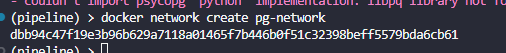

docker image name = test
docker image tag = pandas

build the docker file using the name and tag test:pandas

if you use the same tag when building a new docker image with the same name, the new name:tag will go to the new docker image

and leave the previous one untagged, untagged docker image is known as dangling images

use "docker image prune" to remove dangling (untagged) images

tags in docker image is used for organisation purposes

properly organised docker images and removing untagged images helps save cost and space

*this does not affect other teammates because the docker image we are currently doing is local to each Docker installation*


### Scenario 2: 
    - shared image registry 
    - you and your team uses a registery Docker Hub or private registry
    - images are shared by pushing and pulling, not by building 
    - Computer A: build docker image mycompany/test:pandas 
    - Computer B: docker pull mycompany/test:pandas
    - Computer B: runs the docker image, this is the exact docker image that Computer A created 
    - dangling images still exists if either Computer A or B creates a new docker image with the same tag and name

### by using uv (VM) with docker 
    - solve OS environment issues
    - solves python version, and system libraries issues 
    - have same runtime everywhere 
    - while uv solves fast dependency installation, dependency resolution and lockfile-based reproducibility
    - uv build speed, conssitency of dependency versions and caching efficiency 


### Why use the Docker container as the PostgreSQL server
#### Use cases of UV
    - uv is designed to be a fast Python package and project manager
    - Download packages much faster (parallel downloads and an efficient implementation)
    - Resolve dependencies faster 
    - Create virtual environments quickly
    - Reuse a global package caache so the same package isn't downloaded repeatedly

#### Advantage of using uv with Docker 
    - Faster image builds because dependency installation is quicker
    - Reproducible builds because uv.lock pins exact versions
    - The same dependency management workflow locally and in Docker


#### Why containerize the ingestion script 
    - so the ingestion pipeline runs in a fully controlled, identical environment everywhere 
        - python version, librarise, system dependencies, file paths, runtime behaviour 
    - solves the "it works on my laptop but breaks on yours" save team time to figure out what is different and what is breaking the program in his/her pc 
    - Docker container allows the program to run exactly the same everywhere 
        - by setting up the same Dockerfile, and running the same Docker image, inside the docker image the dependencies libraries and python version are the same as per denoted in the Dockerfile 
        - when executing programs in the docker container, results would be the same

docker build -t taxi_ingest:v001 . 
    - name of docker image: taxi_ingest
    - tag of taxi_image: v001 
    - copy ingest_data.py from the build context (local folder used during docker build) into the Docker image

    Your machine folder (build context)
    ├── Dockerfile
    ├── ingest_data.py  ← copied
    ├── uv.lock
    └── pyproject.toml
            ↓
        docker build
            ↓
    Docker image (/code inside container)
        ├── ingest_data.py
        ├── installed dependencies


    - things within the same network can see each other


## Benefits of Docker Compose

- Single command to start all services
- Automatic network creation
- Easy configuration management
- Declarative infrastructure


```md
## ❌ When you WOULD rebuild the image

You only need to rebuild the Docker image if you change the **build definition or application code**, such as:

- ingestion logic (`ingest_data.py`)
- dependencies (`pyproject.toml`)
- Dockerfile itself

### Example cases where rebuild is required:

- Switching from CSV ingestion → API ingestion
- Adding new tools or frameworks (e.g., Spark, Airflow client, etc.)
- Changing transformation or schema logic inside the pipeline
```
